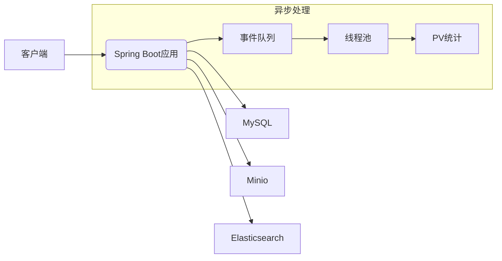

# WeBlog - Spring Boot 博客后端

[](https://spring.io/projects/spring-boot)
[](https://www.mysql.com/)

> 基于 Spring Boot 3 构建的高性能博客后端 API，提供安全的 RESTful 接口和企业级工程实践，支持完整的博客管理功能。

## ✨ 核心功能
- **安全认证** - JWT + Spring Security 实现 RBAC 权限控制
- **内容管理** - 文章/分类/标签/评论/知识库 CRUD 接口
- **文件服务** - Minio 对象存储实现图床功能
- **性能优化** - 事件驱动架构处理 PV 统计，异步线程池
- **全文检索** - Elasticsearch 实现站内中文搜索
- **企业级规范** - 全局异常处理、日志跟踪、参数校验

## 🛠️ 技术栈
| 类别               | 技术方案                          |
|--------------------|-----------------------------------|
| **核心框架**       | Spring Boot 3.x                   |
| **安全框架**       | Spring Security + JWT             |
| **数据库**         | MySQL 8.0                         |
| **ORM框架**        | MyBatis-Plus 3.5+                 |
| **全文检索**       | Elasticsearch                     |
| **对象存储**       | Minio                             |
| **工具库**         | Lombok, Mapstruct, Guava, Jackson |
| **校验框架**       | Hibernate Validator               |
| **Markdown解析**   | flexmark                          |

## ⚙️ 快速运行
```bash
# 克隆项目
git clone 项目地址

# 安装依赖
mvn clean install

# 启动项目 (开发环境)
mvn spring-boot:run -Dspring-boot.run.profiles=dev

# 构建Docker镜像
docker build -t weblog-backend .
```

📊 系统架构



🔗 相关项目

[前端仓库](https://github.com/muying07/weblog-vue-backend)：Vue3 管理后台 + 响应式博客
